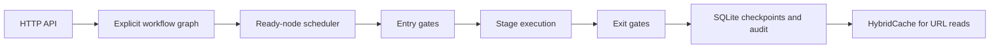

# Governed URL Shortener

A runnable .NET 10 Web API prototype that shortens URLs, records click analytics, and exposes a governed agentic SDLC workflow. The application is organized around the workflow graph and its durable execution state; URL persistence and caching are implementation details behind the workflow service. SQLite uses the host system library rather than a bundled native binary.

## Run

```bash
dotnet run
```

The development OpenAPI document is available at `/openapi/v1.json`. The default launch profile also enables HTTPS.

## API

Create a short URL:

```http
POST /api/short-urls
Content-Type: application/json

{"destination":"https://example.com/article","expiresAt":"2027-01-01T00:00:00Z"}
```

Resolve it with `GET /r/{code}`. Each successful resolution increments the counter and records referer, user agent, IP address, and timestamp. Read metrics with `GET /api/short-urls/{code}/analytics`.

Run the governed workflow:

```http
POST /api/workflows/execute
Content-Type: application/json

{"requirement":"Add URL analytics","scenario":"greenfield"}
```

Supply `workflowId` to resume an existing workflow from its SQLite checkpoints. PR review and merge policy remain outside this runtime API. Audit events are available at `GET /api/workflows/audit`.

The `release-readiness` stage is a high-impact action gate: it pushes a branch and opens a GitHub pull request as an external side effect. It will not execute until a human records an approval decision:

```http
POST /api/workflows/{workflowId}/approvals
Content-Type: application/json

{"stage":"release-readiness","decision":"approved","approver":"reviewer@example.com","reason":"Reviewed test evidence and change set."}
```

Without a recorded approval, `Execute` stops the workflow with status `awaiting-approval` and persists a failed `human-approval` gate evidence row rather than running the handler. A `rejected` decision stops the workflow permanently with status `rejected`. Re-planning after a requirement change invalidates any prior approval for impacted stages, so release must be re-approved. Approval decisions can be read back via `GET /api/workflows/{workflowId}/approvals/{stage}`.

## Architecture



The orchestration graph is stateful and dependency-driven:

`requirements -> architecture -> implementation -> tests -> release-readiness`

The graph is explicitly declared as:

`requirements -> architecture -> implementation -> tests -> release-readiness`

with a parallel-ready documentation branch:

`requirements + architecture -> documentation -> release-readiness`

The scheduler computes ready nodes from completed dependencies rather than relying on declaration order. Every ready wave runs as isolated concurrent workers; shared SQLite checkpoint and audit writes are serialized by the coordinator. Every node has an entry gate, a pluggable `IWorkflowStageHandler`, structured JSON artifact, validation result, and exit gate. Entry and exit gate decisions are persisted as first-class evidence alongside stage artifacts. The implementation handler creates a separate Git worktree and branch named `workflow/{workflowId}`, applies its generated change-set manifest there, commits it, and records the branch/path. Release readiness pushes that branch to `origin`, creates a GitHub pull request containing the requirement, executed test output, artifact hashes, and review instructions, applies configured labels, requests configured users or teams, validates configured required checks against branch protection, and can enqueue the PR in a GitHub merge queue. `appsettings.Development.json` and `appsettings.Production.json` provide environment-specific policy profiles. Set `GITHUB_TOKEN` before executing the workflow; override production reviewers, teams, checks, labels, and merge-queue settings with environment variables such as `Workflow__Reviewers__0`, `Workflow__TeamReviewers__0`, `Workflow__RequiredChecks__0`, and `Workflow__EnableMergeQueue`. Agent/tool-backed handlers can replace the built-in handlers for individual stages without changing graph scheduling or artifact contracts.

`appsettings.Production.json` requires the `.github/workflows/ci.yml` `build-and-test` check before a workflow-generated PR is considered release-ready; `GitHubPullRequestPublisher` calls the branch protection API for `main` and fails the release-readiness stage if that check is not enforced there. Reviewers and team reviewers are left empty by default in production pending an explicit decision on who reviews agent-generated PRs for this repository; set them with `Workflow__Reviewers__0=<github-username>` and `Workflow__TeamReviewers__0=<team-slug>` once assigned. Configure branch protection once per repository with:

```bash
gh api --method PUT repos/ennakili/Charles-Schwab-Assessment/branches/main/protection \
  -H "Accept: application/vnd.github+json" \
  --input - <<'JSON'
{
  "required_status_checks": { "strict": true, "contexts": ["build-and-test"] },
  "enforce_admins": true,
  "required_pull_request_reviews": { "required_approving_review_count": 1 },
  "restrictions": null
}
JSON
```

Run this with an account that has admin rights on the repository; it is a one-time, shared-infrastructure change and is not performed automatically by the workflow. A failed gate stops the workflow safely; a transient test failure retries once, and a failed node records rollback status. Workflow records, stage checkpoints, artifacts, and gate evidence are persisted in SQLite, allowing execution to resume after a process restart. A requirement containing `change` triggers downstream re-planning; a requirement containing `flaky` exercises one bounded retry. PR review and merge policy are external change-control concerns.

## Required scenarios

### Greenfield

Requirement: `Create a URL shortener with click analytics.` The requirements node normalizes the intent, architecture records design decisions, implementation executes the work item, tests validate behavior, and the release gate requires tests plus documentation. Assumption: SQLite is sufficient for a single-node reviewable prototype. Limitation: production scale requires a server-grade relational deployment strategy.

### Brownfield

Requirement: `Change analytics to support a new reporting consumer.` The same graph begins at requirements, records the changed decision, invalidates dependent downstream outputs, and re-plans architecture, implementation, tests, and documentation. The release gate prevents unreviewed change from shipping. Assumption: the consumer contract is still compatible with the existing analytics response.

### Ambiguous

Requirement: `Make links fast and reliable.` The requirements stage preserves the ambiguity as a risk rather than inventing a business SLA. Architecture records the missing durability and scale decisions, and the release gate remains blocked until acceptance criteria are clarified. Limitation: the prototype cannot infer retention, traffic, availability, or abuse requirements.

## Reliability and safety controls

- Domain validation accepts only absolute HTTP(S) destinations and rejects expired links.
- Destinations are screened by `IDestinationAbusePolicy` before a short URL is created, blocking loopback, private-network, link-local (including the `169.254.169.254` cloud metadata endpoint), and configured blocked hostnames (`Abuse:BlockedHosts`) to reduce SSRF and internal-network abuse.
- Short codes are generated with `RandomShortCodeGenerator` (cryptographically random, instance-independent); code collisions are detected before insert and retried up to 5 times without leaking a client-visible error, making generation safe for multi-instance deployment.
- Per-client-IP rate limiting (`RateLimiting:ShortUrlCreate`, `RateLimiting:Redirect`) protects create and redirect endpoints from abuse and returns `429` when exceeded; limits are stricter in `appsettings.Production.json`.
- OpenTelemetry instruments ASP.NET Core and `HttpClient` tracing plus a custom `UrlShortener` meter (short URLs created/resolved/rejected, code collisions, rate-limited requests), exportable via OTLP by setting `Telemetry:OtlpEndpoint`.
- The workflow uses bounded retries, explicit rollback outcomes, cancellation, durable checkpoints, and safe-stop on failed gates.
- The release-readiness stage enforces a human approval checkpoint before it pushes a branch or opens a pull request; approvals and rejections are persisted, audited, and re-required after re-planning.
- Audit events include workflow, stage, action, outcome, detail, and correlation ID.
- Metrics expose success rate, retry count, rollback count, end-to-end latency, and recovery latency.
- No arbitrary code execution, secrets, network fetching, or destructive deployment action is performed by the prototype.
- Remaining hardening: point `Telemetry:OtlpEndpoint` at a real collector, tune per-environment rate limits under production load, and add authentication for workflow control endpoints.

## Testing

```bash
dotnet test Tests/UrlShortener.Tests/UrlShortener.Tests.csproj
```

To run the deployed agent-provider contract test against a real environment:

```bash
RUN_DEPLOYED_PROVIDER_CONTRACTS=true \
AGENT_PROVIDER_BASE_URL=https://agent-provider.example.com \
dotnet test Tests/UrlShortener.Tests/UrlShortener.Tests.csproj --filter DeployedProviderContractTests
```

The test exercises the same execute and compensate HTTP contract used by the workflow handler. It is skipped unless explicitly enabled.

The tests target application behavior rather than controller implementation: URL validation, expiry, click analytics, durable checkpoints, bounded retry, re-planning, and audit traceability. HTTP contract tests should be added before production release.

## Trade-offs and limitations

SQLite keeps setup friction low while providing durable local persistence. The application uses `SQLitePCLRaw.provider.sqlite3` with the host system library, avoiding a bundled native SQLite dependency. HybridCache reduces repeated mapping reads but requires a distributed cache configuration for multi-instance deployments. Short-code generation is deterministic per process and is not a distributed uniqueness strategy. The workflow models agent outputs and governance decisions without invoking an external LLM; an actual agent integration should remain behind a policy-enforced adapter and should never bypass policy or PR change-control gates.
